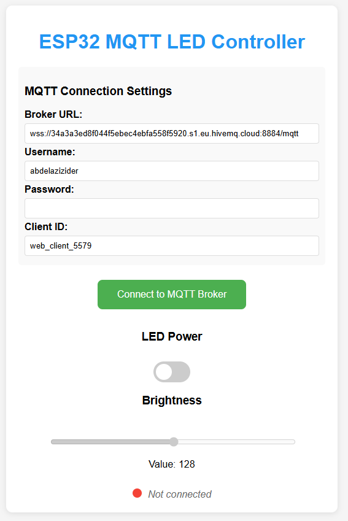

# ESP32 MQTT LED Controller

A smart LED controller project using an ESP32 microcontroller with MQTT connectivity for remote brightness control via a web interface.
Live website here : https://cs-noxthan-az.github.io/ESP32-BLE-LED-Controller-MQTT/

## Project Overview

This project implements a WiFi-connected LED controller with variable brightness control. It uses the MQTT protocol for communication between the ESP32 device and a web-based client interface, allowing users to remotely control an LED's state (on/off) and brightness level.

### Features

- **LED State Control**: Turn LED on/off remotely
- **Brightness Control**: Adjust LED brightness (0-255)
- **Real-Time Status Updates**: Synchronized UI reflecting current LED state
- **Secure Connection**: Uses TLS for secure MQTT communication
- **Web Interface**: Control the LED from any device with a web browser
- **Persistent Brightness Memory**: Remembers brightness settings when toggling on/off

## Hardware Components

- ESP32 Development Board (ESP32 WROOM)
- LED connected to GPIO pin 2 (built-in LED)
- Micro USB cable for power and programming
- Optional: External power supply

## Software Architecture

### ESP32 Firmware

The ESP32 firmware handles:
- WiFi connection
- Secure MQTT client connection to HiveMQ cloud broker
- PWM signal generation for LED brightness control
- Processing incoming MQTT commands
- Publishing status updates

### Web Interface

The browser-based interface provides:
- MQTT over WebSockets connection
- User-friendly toggle switch for on/off control
- Slider for brightness adjustment (0-255)
- Real-time connection status indicators
- Configuration options for MQTT broker settings

## MQTT Communication Protocol

### Topics

- **esp32/led/control**: Commands to turn LED on/off (payload: "ON" or "OFF")
- **esp32/led/brightness**: Values for LED brightness (payload: 0-255)
- **esp32/led/status**: Status updates from ESP32 (payload format: "ON,128" or "OFF,128")

## Setup Instructions

### ESP32 Setup

1. Connect the LED to GPIO pin 2 (or use built-in LED)
2. Install Arduino IDE with ESP32 board support
3. Install required libraries:
   - WiFi
   - WiFiClientSecure
   - PubSubClient
4. Upload the provided sketch to your ESP32

### Web Interface Setup

1. Save the HTML file to your computer
2. Open the file in any modern web browser
3. Enter your MQTT broker credentials
4. Click "Connect to MQTT Broker"
5. Use the controls to interact with your LED

-Connection Details : Url , Port , Websocket 

-Authentication : Username , Password

## Acknowledgments

- HiveMQ for providing the MQTT broker service
- MQTT.js library for browser-based MQTT connections
- Arduino and ESP32 communities for their excellent documentation
